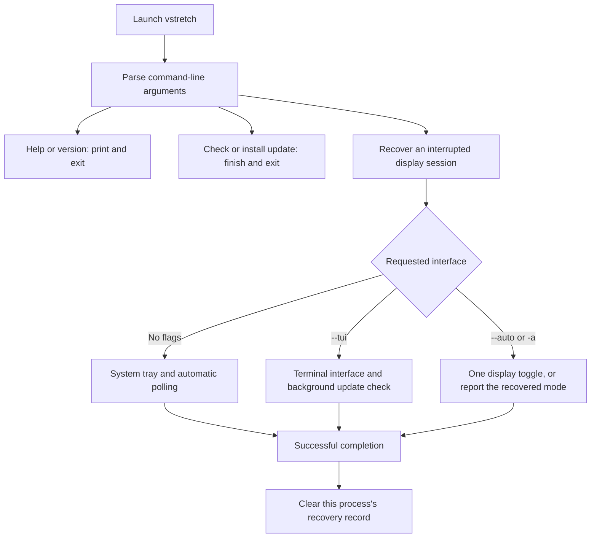
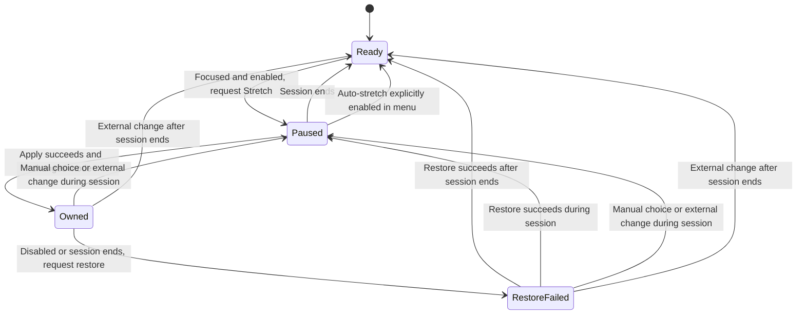
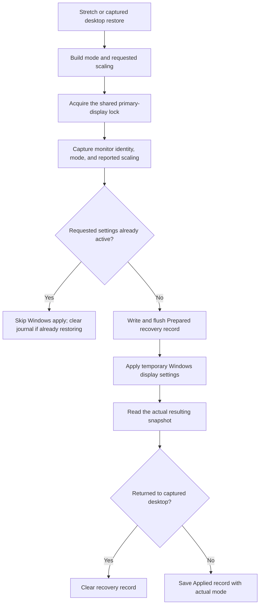

# Project functions and execution flows

This is the behavior map for vstretch. Each user action has an execution tree: what starts it, what the app decides, what changes, and what the user sees. The [core function reference](#core-function-reference) connects those steps to the source.

The Windows app changes the **primary display**. The tray, terminal interface, and command-line toggle share display and configuration functions. Installation and the website have their own flows at the end of this guide.

## Contents

- [Startup and command routing](#startup-and-command-routing)
- [Manual display actions](#manual-display-actions)
- [Saved resolutions and configuration](#saved-resolutions-and-configuration)
- [Automatic stretch and settings](#automatic-stretch-and-settings)
- [Hotkeys and Windows startup](#hotkeys-and-windows-startup)
- [Terminal controls and exit](#terminal-controls-and-exit)
- [Updates](#updates)
- [Shared display execution](#shared-display-execution)
- [Core function reference](#core-function-reference)
- [Installation](#installation)
- [Website actions](#website-actions)
- [Keeping this guide current](#keeping-this-guide-current)

## Startup and command routing

Source: [main.rs](src/main.rs), [tray.rs](src/tray.rs), and [tui.rs](src/tui.rs).



### Open the tray app

Entry: double-click the executable, open its Start Menu shortcut, or run `vstretch`. Functions: `main::run`, `tray::run`, and `tray::App::new`.

```text
Launch without flags
├─ Check for an interrupted display session and recover when eligible
├─ Acquire the tray instance handle for this configuration path
│  └─ Another tray already uses it → return successfully without a second icon
└─ Create the tray app
   ├─ Load configuration, or save defaults when the file is missing
   ├─ Create the icon and menu, and follow the Windows application theme
   ├─ Register the configured global hotkey
   ├─ Read current display, panel signal, and effective native mode
   ├─ Apply the first-launch Windows startup preference
   └─ Enter the Windows message loop
      ├─ Menu selection → handle the selected command
      ├─ Global hotkey → handle Toggle
      └─ Every 750 ms → reload settings, refresh observations, and run auto-stretch
```

Startup and hotkey failures can appear in the tray status while the app remains usable. A configuration load or tray creation failure ends startup.

### Open the terminal interface

Entry: `vstretch --tui`. Functions: `platform::ensure_console`, `tui::run`, and `tui::App::new`.

```text
Request the TUI
├─ Attach to the parent console, or allocate one when needed
├─ Recover an eligible interrupted display session
├─ Load or initialize configuration and read display information
├─ Start an update check on a background thread
└─ Enter raw input mode and the alternate terminal screen
   └─ Repeat: poll update results → draw screen → process a pressed key
```

The TUI starts on Home. Automatic game detection and the global hotkey belong to the tray process. The TUI loads its configuration on startup; it does not periodically reload external edits.

### Show help, version, or argument errors

Entry: `--help`, `-h`, `--version`, or `-V`. Owner: `main::main` and Clap's `Cli` parser.

```text
Launch with arguments
└─ Try to attach to the parent console
   └─ Parse arguments
      ├─ Help → print usage and exit
      ├─ Version → print the package version and exit
      ├─ Conflicting or unknown arguments → print a parser error and exit
      └─ Valid action → continue to its execution flow
```

Help and version stop before recovery or configuration loading. `--tui`, `--auto`, `--check-update`, and `--update` are mutually exclusive.

## Manual display actions

All three actions use the [shared display execution](#shared-display-execution) below. Successful tray actions call `AutoStretch::manual_choice`, pausing automatic switching for the current session. TUI actions show a status message and refresh display information after success. Tray failures show a dialog and a status message; TUI failures stay in the status area.

### Apply Native

Entries: tray **Native**, or TUI action `3` / **Apply native**. Handlers: `Command::Native` and `HomeAction::Native`, through `tui::App::run_native`.

```text
Choose Native
├─ Resolve the restore target: saved native override, otherwise panel signal
│  └─ No target available → report an error
└─ Restore that mode through display::restore_native
   ├─ Recover recorded desktop scaling when the target matches the journal
   ├─ Repair a saved Windows stretch default from an older version if applicable
   ├─ Verify that Windows reports the requested native mode
   └─ Clear the recovery record, then update the interface
```

### Apply Stretch

Entries: tray **Stretch**, or TUI action `2` / **Apply stretch**. Handlers: `Command::Stretch` and `HomeAction::Stretch`, through `tui::App::run_stretch`.

```text
Choose Stretch
├─ Read the saved stretch width and height
├─ Choose refresh: explicit stretch Hz, otherwise panel → native → 60 Hz
├─ Request full-screen stretch scaling through display::apply_profile
└─ Apply through the recovery journal and update the interface
```

The tray requires a known native restore target before allowing Stretch. The TUI's Stretch action can use the refresh fallback without a resolved native mode.

### Toggle Native and Stretch

Entries: tray **Toggle mode**, the registered global hotkey, or TUI action `1` / **Toggle**. Handlers: `Command::Toggle` and `HomeAction::Toggle`, through `tui::App::run_toggle`.

```text
Request Toggle
├─ Resolve the effective native mode
│  └─ Unavailable → report an error
└─ Read the current display through display::toggle_stretch
   ├─ Current width and height equal native → apply saved Stretch
   └─ Any other width and height → restore Native
```

The toggle compares dimensions, ignoring refresh. A custom display mode also toggles to Native.

### Toggle from an external hotkey command

Entry: `vstretch --auto` or `vstretch -a`. Owner: the `cli.auto` branch of `main::run`.

```text
Launch --auto
├─ Recover an eligible interrupted session first
├─ Load existing configuration and resolve Native
│  └─ Missing configuration → error asking for a first normal launch
├─ Recovery restored a mode on this invocation?
│  ├─ Yes → use that mode, avoiding an immediate switch back to Stretch
│  └─ No → run the normal Native/Stretch toggle
└─ Print the resulting mode and preset name, then clear this process's journal
```

This command runs once and skips update checks. If a running tray owns an automatic session, its next poll detects a changed display and relinquishes ownership.

## Saved resolutions and configuration

Source: [config.rs](src/config.rs), [tray.rs](src/tray.rs), and [tui.rs](src/tui.rs).

### Choose a stretch preset

Entries: tray **Stretch presets**, or TUI action `4` / **Change default stretch…**. Handlers: `Command::Preset` and `HomeAction::ChangeStretch`, through `tui::App::apply_preset`.

```text
Choose a preset
├─ Tray
│  ├─ Classify the display against the OLD saved stretch profile
│  ├─ Save the new profile, then replace the in-memory configuration
│  ├─ Was Stretch active?
│  │  ├─ Yes → apply the new preset and pause automatic switching
│  │  └─ No → keep the current display mode
│  └─ Update preset checkmarks and display status
└─ TUI
   ├─ Open the shared built-in preset list
   ├─ Enter → save the selected dimensions with refresh unset
   └─ Show success and return Home; the display mode stays as it was
```

Saving happens before applying a new tray preset. If the display change fails, the new preset remains saved. Tray Native and Stretch checkmarks describe the actual display; preset checkmarks describe the saved choice. A Custom preset row is added at startup when the saved size is outside the built-in list; timer reloads do not rebuild that list.

### Set or clear the native override

Entry: TUI action `5` / **Change default native…**. Handler: `HomeAction::ChangeNative`, through `tui::App::open_native_picker` and `tui::App::apply_native_choice`.

```text
Open the native picker
├─ Ask Windows for unique supported width/height/Hz modes
├─ Include the saved override if Windows does not list a matching choice
├─ Select Auto or the row representing the saved override
└─ Choose a row and press Enter
   ├─ Auto → Config::clear_native removes the override
   └─ Explicit mode → Config::set_native saves dimensions and refresh
      └─ Re-read the effective Native target and return Home
```

Both choices save a future restore target. Applying Native is a separate action. An override without Hz resolves to panel Hz, then 60 Hz. Its picker row prefers panel Hz when listed, otherwise the highest matching refresh.

### Edit the configuration file

Entry: edit `%APPDATA%\vstretch\config.toml`, including custom dimensions, refresh, hotkey, or preferences. `VSTRETCH_CONFIG` selects an alternate absolute file path.

```text
An interface loads configuration
├─ Resolve the default path or absolute VSTRETCH_CONFIG override
├─ Read the complete file under the configuration file lock
├─ Parse the current format, or convert a recognized legacy profile map
├─ Validate positive dimensions, nonzero explicit Hz, and hotkey syntax
└─ Use the result
   ├─ Tray timer → replace settings and re-register the hotkey when changed
   ├─ TUI → use settings loaded at startup
   └─ --auto → use the existing file for this one command
```

`Config::load_or_init` creates defaults only for a missing file. Malformed files remain intact. Legacy migration attempts to save the new format; a failed migration write still permits use of valid parsed settings. Invalid edits during tray polling leave the last valid settings in use and set a status error. A later successful read does not itself clear an earlier status error.

Defaults are 1440×1080 Stretch with panel refresh, automatic Native, auto-stretch enabled, Alt+Tab restoration disabled, and the enabled `Ctrl+Alt+S` hotkey. The startup preference begins unset until the first tray launch.

```text
An action saves settings
├─ Build and validate the proposed configuration
├─ Write TOML to a unique temporary file beside the destination
├─ Flush the staged file, then acquire the configuration file lock
└─ Replace the destination with the complete staged file
   ├─ Success → update the action's in-memory settings
   └─ Failure → retain the previous in-memory settings and report the error
```

## Automatic stretch and settings

Source: [autostretch.rs](src/autostretch.rs), [platform.rs](src/platform.rs), and `tray::App::tick` / `tray::App::run_auto` in [tray.rs](src/tray.rs).

### Enable or disable auto-stretch

Entry: tray **Automatic switching → Auto-stretch Valorant & CS2**. Handler: `Command::AutoStretch`.

```text
Toggle auto-stretch
├─ Save the opposite auto_stretch preference
├─ Enabling while PausedUntilSessionEnds → reset to Ready
└─ Evaluate the automatic policy against the last observed game activity
   ├─ Enabled, Ready, and game focused → request Stretch
   ├─ Disabled and still owns the applied mode → request desktop restoration
   └─ Otherwise → keep the current display
```

Turning this on can resume switching during an existing game session. The tray owns automatic changes only after a successful apply that changes the recorded mode.

### Enable or disable restoration on Alt+Tab

Entry: tray **Automatic switching → Restore desktop on Alt+Tab**. Handler: `Command::RestoreOnAltTab`.

```text
Toggle Alt+Tab restoration
├─ Save the opposite restore_on_alt_tab preference
└─ Re-evaluate the automatic policy
   ├─ Enabled → losing game focus ends the automatic session
   │  └─ Restore an owned change; focus returning can start a new session
   └─ Disabled → losing focus keeps the session alive until the game exits
```

### React to game focus, Alt+Tab, or game exit

Entry: the tray's 750 ms timer. This is automatic behavior following the user's settings.

```text
Timer tick
├─ Reload configuration and read current/panel/native modes
├─ platform::game_activity checks running processes and the foreground process
│  ├─ No supported process → Stopped
│  ├─ Supported process in foreground → Focused
│  ├─ Supported process running elsewhere → Background
│  └─ Query failed → preserve the previous activity; skip auto when enabled
├─ AutoStretch::observe plans a display action or no action
│  ├─ Ready + enabled + Focused → attempt Stretch, pausing before the attempt
│  ├─ Owned + disabled or session ended → attempt restoration of captured desktop
│  ├─ Applied mode replaced externally → relinquish ownership
│  ├─ Paused + session ended → become Ready for a later tick
│  └─ Other cases → leave display unchanged
└─ Apply the planned action, record success/failure, and refresh tray status
```

Supported executables are `VALORANT-Win64-Shipping.exe` and `cs2.exe`, matched without regard to case. Launching a game in the background does not start Stretch. Closing one game while another supported game still runs is not a `Stopped` observation.

An automatic session remembers the desktop mode present before applying Stretch. That captured desktop can differ from the configured Native target. A failed apply pauses until the session ends. A failed restore retains its target for an Exit retry instead of retrying every timer tick.



`Paused` in the diagram is `AutoStretch::PausedUntilSessionEnds`. `Owned` holds the captured desktop and applied mode. `RestoreFailed` is also the state used while a restore is attempted. An apply that finds Stretch already active stays Paused and takes no automatic ownership.

## Hotkeys and Windows startup

### Enable, disable, or change the global hotkey

Entries: tray **Settings → Enable hotkey**, or edit `hotkey` in the configuration. Handler: `Command::HotkeyEnabled`. Source: `Hotkey::sync` in [tray.rs](src/tray.rs) and [config.rs](src/config.rs).

```text
Toggle Enable hotkey
└─ Config::set_hotkey_enabled saves the opposite preference
   └─ Synchronize the registration and menu label

Edit the hotkey text
└─ Next successful tray configuration reload → synchronize registration
   ├─ Disabled or blank → unregister, keeping any saved nonblank text
   ├─ Same active combination → keep the current registration
   └─ Different combination → parse, unregister old, and register new
      ├─ Success → Windows sends WM_HOTKEY when pressed → Toggle flow
      └─ Conflict → show status error while the tray keeps running
```

The parser accepts Ctrl, Alt, Shift, and Win aliases with exactly one main key and at least one modifier. Invalid file edits fail configuration validation before replacing the tray's settings. `Hotkey::sync` also handles invalid text defensively if it receives it directly. Registration uses `MOD_NOREPEAT` to avoid repeat messages from holding the keys.

### Start with Windows

Entry: tray **Settings → Start with Windows**. Handler: `Command::Startup`. Source: [startup.rs](src/startup.rs).

```text
First tray launch with startup preference unset
├─ Write a quoted path to the current executable in the current user's Run key
└─ Save start_with_windows = true

Toggle Start with Windows
├─ Read whether the Run entry matches this executable's quoted path
├─ Save the opposite choice in configuration
├─ Write or remove the Vstretch Run entry
└─ Re-read the registry to update the menu checkmark
```

The key is `HKCU\Software\Microsoft\Windows\CurrentVersion\Run`, value `Vstretch`. Subsequent launches skip first-launch initialization when the preference is set. Editing `start_with_windows` alone does not write the registry entry. If the registry write fails after saving a menu choice, the preference is saved but the menu reflects the actual registry state.

### Follow the Windows menu theme

Entry: tray initialization and Windows theme/settings broadcasts. Source: [theme.rs](src/tray/theme.rs), `follow_system_theme`, and `theme_proc`.

```text
Create tray icon
├─ Resolve supported Windows theme functions
│  └─ Unavailable → retain the default Windows menu behavior
└─ Opt in to the application theme and observe the tray window
   ├─ Theme/settings changed → refresh menu theme policy
   └─ Window destroyed → remove the callback
```

## Terminal controls and exit

Source: `tui::App::on_key`, the screen-specific key handlers, and `TerminalSession` in [tui.rs](src/tui.rs).

### Navigate, select, cancel, and refresh

```text
Pressed TUI key
├─ Update confirmation open → Enter installs; Esc or q dismisses
├─ u → update action, independent of the current screen
└─ Dispatch to the current screen
   ├─ Home
   │  ├─ Up/Down or k/j → move selection, wrapping at either end
   │  ├─ Enter → execute the selected HomeAction
   │  ├─ 1–5 → Toggle, Stretch, Native, stretch picker, native picker
   │  ├─ r → re-read current, panel, and effective Native modes
   │  └─ q or Esc → request Quit
   ├─ Stretch picker
   │  ├─ Up/Down or k/j → move selection; Enter → save preset
   │  └─ Esc, q, or Backspace → return Home without saving
   └─ Native picker
      ├─ Up/Down or k/j → move selection; Enter → save native choice
      ├─ r → refresh display observations and rebuild the mode list
      └─ Esc, q, or Backspace → return Home without saving
```

Refresh reads display information; it does not reload the TUI's configuration or switch resolution. Normal drawing shows the latest observations stored by the TUI, rather than querying Windows on every frame.

### Quit the TUI

Entries: Home **Quit**, `q`, or `Esc`. Handler: `HomeAction::Quit`.

```text
Request Quit on Home
├─ Update installation running → keep TUI open and show a waiting message
└─ Otherwise → stop the terminal loop
   ├─ Disable raw input, leave the alternate screen, and show the cursor
   └─ Successful main::run completion → recovery::finish clears this owner's record
```

Manual display settings remain active after a clean TUI quit. Backing out of a picker remains possible during installation. Terminal cleanup also runs when the TUI exits with an error.

### Exit the tray

Entry: tray **Exit**. Handler: `Command::Exit`, through `tray::App::restore_on_exit`.

```text
Choose Exit
├─ Does the automatic session still own the exact currently applied mode?
│  ├─ Yes → restore its captured desktop and reset the automatic state
│  │  └─ Restore fails → show error and keep the tray running
│  └─ No → leave the current display mode active
└─ End the loop, drop the timer/hotkey/icon/instance handles
   └─ Successful completion → clear this process's recovery record
```

Manual mode choices and externally replaced modes survive Exit. A normal Windows message-loop quit also attempts restoration. A message-loop error attempts restoration before returning its error.

## Updates

Source: [update.rs](src/update.rs), [main.rs](src/main.rs), and `UpdateState` in [tui.rs](src/tui.rs).

### Check for an update

Entries: `vstretch --check-update`, automatic TUI startup check, or TUI `u` when Current or Failed.

```text
update::check
├─ Request GitHub's latest release, with a 10-second request timeout
├─ Parse and compare semantic versions with the installed package version
│  └─ Draft, prerelease, equal, or older → no available update
├─ Validate the vstretch.exe asset URL, size, and SHA-256 metadata
└─ Return available release, no newer release, or an error
   ├─ CLI → print availability/current version; errors go to stderr
   └─ TUI worker result → poll_update sets Available, Current, or Failed banner
```

The CLI update branches finish before display recovery and configuration loading. A TUI check failure leaves the interface usable, with `u` available to retry.

### Install an update from the CLI

Entry: `vstretch --update`.

```text
Check for a newer stable release
├─ None → print that this version is up to date
├─ Check failed → report error and exit
└─ Available → update::install
   ├─ Download with a 120-second request timeout
   ├─ Verify declared size, SHA-256, and the Windows MZ header
   ├─ Stage the verified executable and back up the current executable
   ├─ Replace the executable; recover the backup if replacement removed the original
   └─ Print success and ask the user to reopen vstretch
```

Update installation preserves configuration and does not relaunch the app. Verification failure stops replacement. If both replacement and backup restoration fail, the error identifies the retained backup path.

### Install, defer, or retry an update from the TUI

```text
Press u
├─ Available → show confirmation
│  ├─ Esc or q → dismiss and keep using the current version
│  └─ Enter → run update::install on a background thread
│     ├─ Keep drawing and handling input; prevent quitting during installation
│     └─ Poll result → Installed restart notice, or Failed error banner
├─ Current or Failed → start a new background check
└─ Checking, Installing, or Installed → no new action
```

The TUI calls the same verification and replacement functions as the CLI. A disconnected worker channel becomes a Failed banner. After success, quitting and reopening loads the new executable.

## Shared display execution

Source: [display.rs](src/display.rs) and [recovery.rs](src/recovery.rs).

### Apply a temporary mode



`display::apply_profile` requests full-screen scaling. `display::change_resolution` requests a mode without an explicit new scaling value. When the request returns to the recorded desktop, recovery supplies the captured scaling value if known.

`recovery::change` keeps the original desktop snapshot across successive changes while the journal still matches the current monitor and mode. Failure to publish the Prepared record prevents the Windows call. A Windows apply or later verification/write failure leaves recovery information available.

The no-change check includes refresh and any requested scaling. Unknown reported scaling cannot prove that an explicit scaling request is already active. Ordinary changes omit `CDS_UPDATEREGISTRY`, so they leave the Windows default used after reboot intact.

### Restore Native and repair an older saved default

```text
display::restore_native → recovery::restore_native
├─ Acquire display lock and read current snapshot, journal, and saved Windows mode
├─ Reuse captured scaling only when the journal matches and its desktop is the target
├─ Saved Windows mode matches Stretch, but requested Native does not?
│  ├─ Yes → apply Native with CDS_UPDATEREGISTRY to repair that old default
│  └─ No → apply temporarily only if the requested settings differ
└─ Verify the exact Native mode, then clear the recovery record
```

Only an explicit Native action or a toggle to Native performs this repair. Ordinary automatic restoration and startup recovery do not guess a replacement Windows default.

### Recover after an interrupted process

The journal sits beside the active configuration with extension `.recovery.toml`, normally `%APPDATA%\vstretch\config.recovery.toml`.

```text
Next tray, TUI, or --auto launch → recovery::recover
├─ Acquire the shared display lock and load/validate the recovery record
│  ├─ No record → continue normally
│  └─ Corrupt or unsupported record → return an error before display changes
├─ Check recorded PID AND process creation time
│  └─ Owner still alive → leave its session alone
├─ Compare current monitor identity and mode with the recorded change
│  └─ Different monitor or unrelated mode → clear stale record, preserve display
└─ Restore the captured desktop mode and scaling if needed
   ├─ Verify monitor and restored mode
   ├─ Success → clear record and return the recovered mode
   └─ Failure → retain record and return an error for a later launch to retry
```

Prepared records accept either the mode before the attempted switch or the requested mode. Applied records accept the actual recorded mode. Ownership checks compare monitor identity and mode; they do not compare current scaling. Reused process IDs alone cannot count as a live owner.

### Finish a successful session

```text
Successful tray/TUI/--auto completion → recovery::finish
├─ Acquire display lock and load the recovery record
├─ This process owns it → clear the record without switching the display
└─ Another process owns it, or none exists → leave it alone
```

The tray's in-memory automatic ownership determines restoration on Exit. The durable journal enables recovery after interruption. Clearing a journal does not itself restore the display.

## Core function reference

These are the production functions shared by the user interfaces and the functions supporting domain decisions. Private decision functions that matter to the execution trees are included. Tests and drawing helpers are outside this catalog.

### Profiles, configuration, and hotkeys

Source: [config.rs](src/config.rs).

| Function | Responsibility |
| --- | --- |
| `Profile::new` | Build dimensions with refresh unset. |
| `Profile::name` | Format width and height with an `x` separator for the saved preset name. |
| `PopularPreset::resolution_label` | Format aligned dimensions for preset list rows. |
| `Config::default` | Supply first-use display and preference defaults. |
| `Config::config_path` | Resolve the default configuration path or validate an absolute override. |
| `Config::load` / `Config::load_from_path` | Read, parse, validate, and attempt legacy migration. Missing config is an error. |
| `Config::load_or_init` | Load an existing file or save defaults when missing. |
| `Config::validate` / `validate_profile` / `validate_hotkey` | Reject zero dimensions, zero explicit refresh, and invalid nonblank hotkeys. |
| `parse_config` / `Config::from` / `parse_res_name` | Convert a recognized legacy profile map into the current configuration. |
| `Config::save` / `Config::save_default_path` | Validate, stage, flush, and replace a complete configuration file under a publication lock. |
| `Config::update_and_save` | Save a proposed change before replacing the caller's in-memory configuration. |
| `Config::set_stretch` | Save new stretch dimensions with refresh unset and return the name. |
| `Config::set_native` / `Config::clear_native` | Save or remove the native override. |
| `Config::set_hotkey_enabled` | Save the registration preference while preserving the combo text. |
| `config::parse_hotkey` / `key_to_vk` | Convert a validated combination into Windows modifier bits and a virtual key. |
| `config::canonical_hotkey` | Format a consistent hotkey label from the parsed combination. |

### Display discovery and rules

Source: [display.rs](src/display.rs).

| Function | Responsibility |
| --- | --- |
| `Mode::label` | Format width, height, and Hz for status messages. |
| `Mode::size_eq` | Compare width and height, ignoring refresh. |
| `Mode::matches_profile` | Match dimensions and also refresh when the profile specifies it. |
| `DesktopSnapshot::matches_settings` | Match exact mode and any requested scaling; unknown scaling cannot satisfy an explicit request. |
| `display::get_current_resolution` | Read the active primary desktop mode through GDI. |
| `display::get_saved_resolution` | Read the Windows display default saved in the registry. |
| `display::get_native_resolution` / `primary_display_name` | Match the primary GDI source to its active CCD target signal and read dimensions and Hz. |
| `display::desktop_snapshot` | Capture primary monitor identity, active mode, and reported fixed-output scaling. |
| `display::list_display_modes` | Enumerate, deduplicate, and sort reported modes by descending height, width, then Hz. |
| `display::resolve_native` / `display::native_override_mode` | Choose an override or panel signal; override Hz falls back to panel Hz, then 60. |
| `display::stretch_refresh` | Choose panel Hz, then effective Native Hz, then 60, before an explicit stretch refresh override. |
| `display::preferred_override_mode` | Find the native picker row for an override, preferring its specified Hz or panel Hz, then the highest match. |
| `display::classify_mode` | Classify dimensions in order: Native, Stretch, Panel, Other; unreadable current mode is Unknown. |
| `display::toggle_stretch` | Apply Stretch if dimensions match Native; otherwise restore Native. |
| `display::apply_profile` | Construct the stretch mode, request stretch scaling, and return the requested mode after success. |
| `display::change_resolution` / `change_resolution_with_scaling` | Route a temporary mode request through recovery. |
| `display::restore_native` | Route explicit Native restoration and legacy default repair through recovery. |
| `display::apply_display_settings` / `resolution_devmode` / `check_display_change` | Build the Windows request, call `ChangeDisplaySettingsExW`, and translate its result into success or a mode-specific error. |

Native detection reads the panel's active output signal, rather than treating a stretched desktop size as native. Mode classification ignores refresh; recovery ownership and automatic ownership compare complete `Mode` values, including refresh.

### Automatic session decisions

Source: [autostretch.rs](src/autostretch.rs). These functions plan and track actions without calling Windows.

| Function | Responsibility |
| --- | --- |
| `GameActivity::session_ended` | Treat game exit as the end; include background focus loss when Alt+Tab restoration is enabled. |
| `AutoStretch::observe` | Update session state and request Stretch, Restore, or no action. |
| `AutoStretch::applied` | Own a successful changed mode, or remain paused if the desktop mode was already equal. |
| `AutoStretch::restored` | Become Ready after the session ends; otherwise pause. |
| `AutoStretch::manual_choice` | Relinquish automatic ownership and pause until the session ends. |
| `AutoStretch::restore_on_exit` | Return a restore target only when an Owned or RestoreFailed applied mode is still active. |

### Recovery, ownership, and locks

Source: [recovery.rs](src/recovery.rs) and [platform.rs](src/platform.rs).

| Function | Responsibility |
| --- | --- |
| `recovery::recover` / `Session::recover` | Recover a dead owner's matching monitor/mode, retaining the journal on restoration failure. |
| `recovery::change` / `Session::change` | Capture the desktop, avoid unchanged applies, journal before switching, and record the resulting mode. |
| `recovery::restore_native` / `Session::restore_native` | Restore an explicit native target and repair only a matching legacy saved stretch default. |
| `recovery::finish` / `Session::finish` | Clear this process's recovery record after successful completion without switching the display. |
| `session` / `Session::new` | Bind the active configuration's journal path to the current process identity. |
| `Journal::load` / `Journal::save` / `Journal::clear` | Validate durable records, publish flushed replacements, and remove completed records. |
| `Record::owns` / `Change::matches` | Check monitor identity and modes permitted by the journal state. |
| `platform::current_process_identity` / `process_created` | Identify a process by PID and creation time. |
| `platform::process_is_alive` | Check both liveness and creation time, accounting for PID reuse. |
| `platform::tray_instance` | Keep one tray instance per configuration path. |
| `platform::config_file_lock` | Coordinate reads and completed file replacements for one configuration path. |
| `platform::display_lock` | Serialize primary-display changes across tray, TUI, and external toggle processes. |
| `mutex_name` / `named_lock` | Build configuration-specific mutex names and acquire a Windows mutex guard. |

### Windows integration and updates

Sources: [platform.rs](src/platform.rs), [startup.rs](src/startup.rs), [update.rs](src/update.rs), and [theme.rs](src/tray/theme.rs).

| Function | Responsibility |
| --- | --- |
| `platform::game_activity` / `has_running_game` / `foreground_is_game` / `is_game_executable` | Detect supported process presence and foreground focus, preserving uncertainty on query failure. |
| `platform::attach_console` / `platform::ensure_console` | Attach CLI output to the parent console or allocate a terminal for the TUI. |
| `platform::show_error` | Display a Windows error dialog for launch or manual tray failures. |
| `startup::initialize` | Enable startup and save the preference once when it is unset. |
| `startup::enabled` / `command` | Compare the per-user Run entry with a valid quoted path to this executable. |
| `startup::set_enabled` | Write or remove the per-user Run entry. |
| `theme::follow_system_theme` / `ThemeApi::load` / `ThemeApi::refresh` / `theme_proc` | Follow supported Windows application-theme changes for the native tray menu. |
| `update::check` / `select_release` | Fetch release metadata and select a newer stable release with a validated asset. |
| `update::install` / `verify_binary` | Download and verify exact size, SHA-256, and Windows executable header before staging. |
| `replace_executable` | Back up and replace the executable, attempting recovery after a failed replacement. |
| `client` | Build the HTTPS update client with connection and request timeouts. |

## Installation

Sources: [install.ps1](install.ps1) and [install.sh](install.sh). Installation prepares the app; it does not launch the tray or apply a display mode.

```text
Run the PowerShell installer
├─ Require 64-bit Windows and request latest stable release metadata
├─ Validate release tag, exactly one executable asset, URL, size, and SHA-256
├─ Resolve the installation directory and acquire its exclusive installer lock
├─ Existing executable already has the expected hash?
│  ├─ Yes → skip download and replacement
│  └─ No → download to a unique file in the installation directory
│     ├─ Verify size, hash, and MZ header
│     └─ Replace the existing executable, or move it into a fresh destination
├─ Unless -NoPath → add the directory to user PATH and this session's PATH
├─ Unless -NoShortcut → create or repair the per-user Start Menu shortcut
└─ Print the install location and launch instructions; clean staging and release lock

Run the shell installer
├─ Require a Windows Git Bash/MSYS/Cygwin environment and powershell.exe
├─ Download install.ps1 from the site, falling back to GitHub if that fails
├─ Translate the temporary path for Windows when cygpath is available
└─ Invoke PowerShell with forwarded arguments, then remove the temporary script
```

The default folder is `%LOCALAPPDATA%\vstretch\bin`; `-InstallDir` selects another folder. Re-running repairs PATH and the shortcut even if no download is needed. A replacement blocked by a running app reports that vstretch must be closed. The installer does not compare against the installed version, so it installs GitHub's current stable asset even if a local executable is newer.

## Website actions

The website is a static export. Release information is resolved at build time by `getLatestRelease` in [release.ts](website/lib/release.ts). Its interactive controls run in the visitor's browser.

### Try Native, Stretch, or a preset in the preview

Source: `TrayPreview` and `isPreset` in [tray-preview.tsx](website/components/tray-preview.tsx).

```text
Click Native or Stretch → validate the value → update local mode state
└─ Re-render checkmark, displayed resolution, illustration, and accessible status

Select a preview preset → isPreset validates membership → update local preset state
└─ Stretch mode shows selected dimensions; Native continues to show 1920×1080
```

The preview has three presets and starts at 1440×1080 Stretch. It updates the illustration without calling the Windows app or changing the visitor's display. The auto-stretch line in the preview is a label, not a setting control.

### Download the executable or inspect release details

Sources: [landing page](website/app/page.tsx), `Download` in [download page](website/app/download/page.tsx), and [site endpoints](website/lib/site.ts).

```text
Build the website → getLatestRelease fetches and formats stable-version metadata
├─ Metadata available → publish version, size, asset download count, and pinned links
└─ Request or validation fails → use latest-release links without invented metadata

Click a landing-page download button → navigate to /download
Visit /download → load the static download page
├─ After 600 ms → browser navigates to its pinned or fallback executable URL
└─ Click the download-page button → navigate to the same URL manually

Click Source or SHA-256 → open the pinned source tree or GitHub release page
```

Rebuilding refreshes the website's metadata. The desktop updater and installer independently query GitHub when run. A displayed SHA-256 is release information; the browser download flow does not verify the downloaded file itself.

### Copy or read the installer command

Source: `CopyCommand` and its `copy` handler in [copy-command.tsx](website/components/copy-command.tsx).

```text
Expand Install with PowerShell → reveal command and Copy button
├─ Click Copy → request clipboard write
│  ├─ Success → show Copied, then reset after 3.5 seconds
│  └─ Failure → select the command and show instructions to press Ctrl+C
└─ Click Read the install script → open the site's /install.ps1 asset
```

The command is copied as text. Executing it in PowerShell starts the [installation flow](#installation).

### Open instructions, FAQ answers, and other pages

Sources: [landing page](website/app/page.tsx), `Disclosure` in [disclosure.tsx](website/components/disclosure.tsx), [changelog page](website/app/changelog/page.tsx), and [privacy page](website/app/privacy/page.tsx).

```text
Click a disclosure, verification details, or FAQ question
└─ Toggle local expanded state → reveal or hide the associated content

Click section navigation or Try the preview
└─ Navigate to the matching anchor on the current page

Open Changelog
└─ Show release/version/date groups produced by getChangelog at build time
   ├─ renderInline formats inline code in the listed changes
   └─ Release or full-history links → open the corresponding GitHub page

Open Privacy, Home, GitHub, license, author, or issue links
└─ Navigate to the link's page or external destination
```

These controls reveal information or navigate pages. They do not save desktop preferences.

## Keeping this guide current

Each feature entry records its trigger, decisions, state changes, result, and failure behavior. Shared work lives in one execution section so an action can refer to it without repeating the recovery flow.

The repository check is `powershell -NoProfile -File scripts/check-functions-docs.ps1`, run from the project root. It checks that the guide names every tray command, TUI Home action, explicit CLI action, and production public function in the core Rust modules. It also checks local Markdown links and balanced diagram/tree fences. It does not prove execution order or behavioral accuracy.

A behavior change needs a corresponding tree update, including changes to error handling, ownership, or save/apply order. A new command or core public function name fails the check until documented. Private function changes, website interactions, and installer behavior still require source review.

The function inventory can also be inspected with `rg -n '^\s*(pub(\([^)]*\))?\s+)?fn\s+' src`. The execution trees describe the source in this checkout; they are maintained descriptions, rather than generated call graphs.
