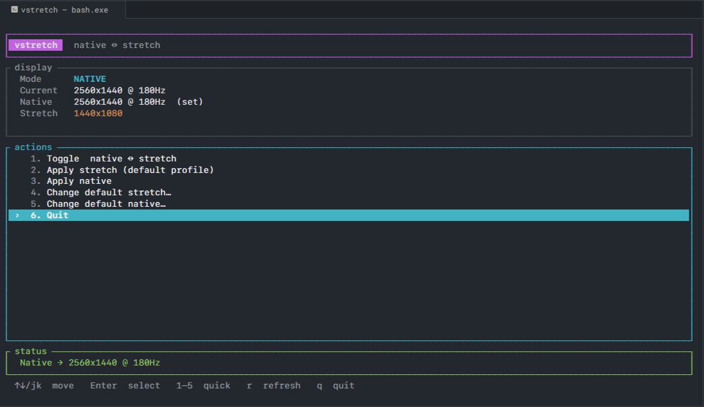

# vstretch

**Wanna play stretch, then go back to native in one click? We got you.**

vstretch is a small Windows TUI for FPS players who run **stretched resolutions** in games like **Valorant** and **CS2**. Hop into stretch before a session, then flip back to native when you’re done — no digging through Windows display settings every time.

Built for the classic loop:

1. **Stretch** — lower res, wider models, the competitive look
2. **Play**
3. **Native** — one click (or one hotkey) and your desktop is normal again



## Install

**Windows only.** No Rust, no cargo — just the exe.

1. Grab **`vstretch.exe`** from the [latest release](https://github.com/blocksdevpro/vstretch/releases/latest)
2. Put it somewhere handy (Desktop, `C:\Tools`, etc.)
3. Double-click to open the TUI, or run it from a terminal

Optional: add that folder to your PATH if you want `vstretch` / `vstretch -a` from anywhere (handy for hotkeys).

<details>
<summary>Build from source (Rust)</summary>

```powershell
cargo install --git https://github.com/blocksdevpro/vstretch.git
# or from a local clone:
cargo install --path .
```

</details>

## Usage

### TUI (default)

```powershell
vstretch
```

| Key | Action |
|-----|--------|
| `↑` `↓` / `j` `k` | Move |
| `Enter` | Select |
| `1`–`5` | Quick actions |
| `r` | Refresh display info |
| `q` / `Esc` | Quit (or back) |

Everything lives in the TUI: toggle, native, stretch, and picking default stretch / native resolutions.

### Hotkey toggle

One quiet command for PowerToys / AutoHotkey / etc.:

```powershell
vstretch --auto
# short:
vstretch -a
```

Prints one line, e.g. `1440x1080 @ 180Hz [1440x1080]`.

## Config

Created automatically on first launch at:

`%APPDATA%\vstretch\config.toml`

Change the defaults in the TUI under **Change default stretch…** / **Change default native…**.

Native is auto-detected from the panel unless `[native]` is set. Stretch uses panel refresh unless `refresh` is set on `[stretch]`.

```toml
# vstretch — omit [native] to auto-detect the panel

[stretch]
width = 1440
height = 1080

[native]
width = 2560
height = 1440
refresh = 180
```

## Notes

- **Windows only** (Win32 display APIs)
- Changes the **primary** display
- Native res is detected from the panel (CCD) unless you set an override
- Stretch requests full-screen scaling to fill the display
- Set the same resolution in-game. If a game overrides desktop scaling, select full-screen scaling in the game or GPU control panel

## License

MIT
